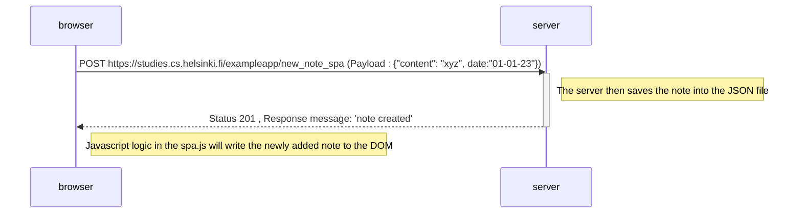

```mermaid
sequenceDiagram
    participant browser
    participant server

    browser->>server: POST https://studies.cs.helsinki.fi/exampleapp/new_note_spa (Payload : {"content": "xyz", date:"01-01-23"})
    activate server
    Note right of server: The server then saves the note into the JSON file
    server-->>browser: Status 201 , Response message: 'note created'
    deactivate server

    Note right of browser: Javascript logic in the spa.js will write the newly added note to the DOM
```
